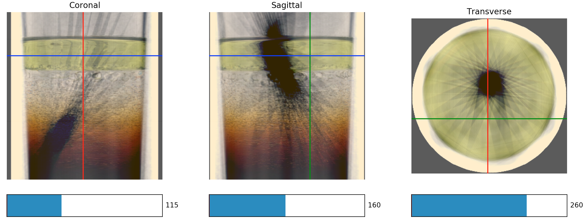

## Optical Tomography

This repo implements a rough attempt at optical tomography. Essentially, images acquired via light transmitted through a transparent or translucent medium are reconstructed into a 3D volume.

 

I used a drinking glass with layers of soy sauce, water, and oil, as well as a chopstick passing through all three layers. The reconstruction is recognizable, but suffers from a few artifacts which were likely introduced by:
- Coarse angular steps of about 11.25 degrees
- Less-than-ideal imaging setup (the light source is the lamp from my living room, the camera is my iPhone sitting on top of an iClicker box)

Nonetheless, it manages to illustrate the core principles of tomography and subsequent reconstruction, so I though I'd share it.

### Usage

The main way to use this code is via reconstruction.py. This module implements the Reconstructor class, which can be used as follows:
```python
from reconstruction import Reconstructor
from volume_explorer import VolumeExplorer  # optional, for visualization purposes

# Data to reconstruct
directory = 'path to raw files'

# Reconstruction parameters
angle_step = 1  # angle by which sample was rotated between images
crop = {
    'top_left': [1356, 1080],  # top left corner of crop region
    'width': 1300,  # width of crop region
    'height': 1405  # height of crop region
}
scale = 1  # scaling factor, primarily used to scale down large images
std_range = 1  # reconstructed data has outliers removed
               # only values within median +- std_range * stdev are kept
channel_wise = True  # flag to perform reconstruction by channel, then recombine
save = True  # flag for saving reconstructed images
verbose = True  # flag to print out reconstruction steps

# Reconstruct volume
recon = Reconstructor(directory, angle_step, crop=crop, scale=scale)
volumes = recon.reconstruct(std_rng=std_range, channel_wise=channel_wise, save=save, verbose=verbose)

# Open reconstruction (optional)
explorer = VolumeExplorer(volumes[-1])
explorer.start()
```
It is assumed that images are oriented such that the transverse plane of the subject is parallel to the bottom of all images.

The examples directory contains one set of raw images from the trial mentioned above. The reconstruction parameters for this set are given in examples/examples.py. To run the example, modify the parameters if desired and then run reconstruction.py. Once reconstruction is complete, the reconstructed volume can be viewed via the Volume Explorer, which is launched after reconstruction or may be run from a command line. Try running
```bash
python volume_explorer.py --help
```
to see how to use the explorer. The --cmap argument takes any standard Matplotlib colour map.


### Requirements
Requirements are given in requirements.txt. Note that it's possible that some of the listed packages are not really required.